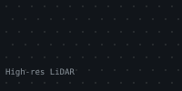
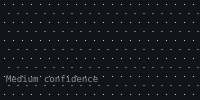
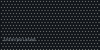
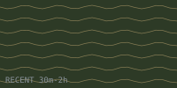
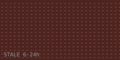
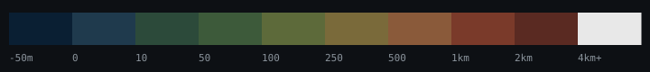

# SIGINT Terrain Rendering Engine — v2.1

> A deterministic compiler that transforms terrain elevation, telemetry freshness, provenance, and denied-space geometry into audit-friendly tactical 2D/3D outputs. **The system acts like a compiler, not a stylist.**

📦 **Repository:** [augustave/SIGINT-TWO](https://github.com/augustave/SIGINT-TWO) · 📖 [Glossary](https://github.com/augustave/SIGINT-TWO/blob/main/GLOSSARY.md) · 📜 [README](https://github.com/augustave/SIGINT-TWO/blob/main/README.md)

---

## What This Is

This repository is a **specification bundle** — not a runtime. It is the complete, machine-checkable design contract for a SIGINT terrain rendering engine that downstream coding agents (or human implementors) can build against without inventing layer rules, field names, or fallback behavior.

The bundle treats **rendering as evidence handling**. Every visible mark on the screen must answer a tactical question. Texture, tone, contour, and wash are operational encodings — never cosmetic effects.

### Why this design exists

Most terrain rendering systems collapse operational meaning into visual taste. Stipple becomes "decoration." Crosshatch becomes "pattern fill." Color becomes a palette choice. The result: feed freshness, provenance, and denial semantics drift between screens and device classes, and operators stop trusting what they see.

This bundle locks down those semantics. The renderer is required to **fail loudly** when trust state is uncertain, rather than render something pretty and ambiguous.

---

## Core Doctrine

| Invariant | Meaning |
|---|---|
| **Texture Is Meaning** | Grain = provenance/confidence. Hatching = slope severity. Crosshatch = denied/contested area. Wash = data age. None of these are decorative. |
| **Compositing Is Law** | The 7-layer canonical order is fixed and semantically meaningful. Reordering is a doctrine violation. |
| **Terrain Must Be Honest** | All elevation rendering must declare datum, source class, and z-exaggeration. No silent assumptions. |
| **Degradation Must Be Visible** | Performance fallback is allowed; silent semantic loss is not. Every suppressed layer must carry a reason. |

---

## The 7-Layer Canonical Stack


Layer order is **fixed** and **semantically ordered**. Reordering is a doctrine violation. → [Layer Stack pattern card](pattern_cards/layer_stack.md)

---

## Multi-Agent Architecture

The renderer is decomposed into 10 cooperating agents (full topology in [SWARM.md](https://github.com/augustave/SIGINT-TWO/blob/main/sigint_terrain_bundle/SWARM.md)):

```
┌─────────────────────────┐
│   RenderOrchestrator    │  ← entry point; owns the run, merges outputs
└────────────┬────────────┘
             │
   ┌─────────┼──────────────────────────────┐
   ▼         ▼                              ▼
TerrainProfile  DatumNormalization   TerrainInterpretation
   Agent          Agent                 Agent
                                          │
            ┌─────────────────────────────┼─────────────────────────┐
            ▼ (parallelizable)            ▼                         ▼
       TelemetryState              ThreatOverlay              LOSFresnel
          Agent                       Agent                     Agent
            └─────────────────────────────┼─────────────────────────┘
                                          ▼
                              LayerCompilation
                                  Agent
                                          │
                                          ▼
                              Verification → Packaging
                                  Agent      Agent
```

Steps 5, 6, and 7 (Telemetry, Threat, LOS/Fresnel) have no inter-dependencies and may run concurrently.

**Error propagation:** Blocking errors halt downstream dependents immediately. Non-blocking warnings accumulate into the manifest. The PackagingAgent must include all warnings even in `blocked` outputs — a blocked package is still a valid, reproducible artifact explaining the block.

---

## Pattern Cards

Each card pairs a visual primitive with the doctrine that governs it.

### [Confidence Stipple](pattern_cards/confidence_stipple.md)

Grain density encodes provenance. Higher density = lower trust.

| High-res LiDAR | Medium | Interpolated | Synthetic |
|---|---|---|---|
|  |  |  |  |

### [Uncertainty Wash](pattern_cards/uncertainty_wash.md)

Wash saturation encodes feed age. CURRENT shows nothing. **A feed with no timestamp never becomes `CURRENT` or `RECENT` — it is forced to `STALE` plus a hard warning, or, if safety-relevant, the entire output is blocked.**

| CURRENT | RECENT | AGING | STALE | HISTORICAL |
|---|---|---|---|---|
|  |  |  |  |  |

### [Slope Hachure](pattern_cards/slope_hachure.md)

Hachure spacing encodes slope severity.

| 5–15° | 15–30° | 30–45° | 45°+ |
|---|---|---|---|
|  |  |  |  |

### [Denied / Contested Zones](pattern_cards/denied_zones.md)

High-contrast crosshatch in the red family. Never feathered, never decorative.


### Live Scan Lines (4% opacity)

Applied only to live ingest surfaces. Never to archived stills or analysis exports.


### Tactical Hypsometric Bands (first 5 only)

The only permitted hypsometric palette. Rainbow ramps are prohibited.



---

## Terrain Profiles

| Profile | Use case | Notable parameters |
|---|---|---|
| `standard_regional` | General regional viewport | z-exaggeration by zoom table, 10 m contour interval, 45° hillshade altitude |
| `nyc_littoral_low_relief` | NYC harbor / low-relief coastal | z-exaggeration 3.0, 5 m contours, 35° altitude, mandatory bathymetry merge if water crossed |
| `alpine_high_delta_z` | High-relief mountain terrain | z-exaggeration clamped 1.0–1.5, contours over hillshade microtexture |
| `urban_canyon_lidar` | Dense urban LiDAR contexts | Bare-earth DEM preferred; LOS requires building-contamination warning if DSM used |

## Device Classes & Degradation

| Device | Texture budget | Degradation behavior |
|---|---|---|
| `desktop_analyst` | Full 7-layer stack | 2D + profile + optional 3D |
| `field_tablet` | Max 3 simultaneous textures | **Semantic suppressions first** (scan_line on non-live), then **performance suppressions** in priority order: stipple → contour → wash. Always emit `REDUCED_SEMANTIC_FIDELITY`. |
| `degraded_edge_device` | Hillshade + 1 operational overlay | Suppress 3D. Emit degraded-state badge. |

---

## Output Contract

Every successful run produces a reproducible package:

```
/layers/*                      # Compiled layer assets
/patterns/*                    # SVG / shader patterns
/shaders/*                     # GLSL or equivalent
/profiles/*                    # Selected terrain profile parameters
/render_state_manifest.json    # Authoritative state record
/verification_report.md        # Human-readable pass/fail report
```

The `render_state_manifest.json` is validated end-to-end against [`common-schema.yaml`](https://github.com/augustave/SIGINT-TWO/blob/main/sigint_terrain_bundle/common-schema.yaml).

---

## Acceptance Gates

A render is valid only if **all** of the following are true:

1. Layer order matches the canonical 7-layer stack
2. No illegal palette is used (no rainbow hypsometric, no decorative denied-zone patterns)
3. Timestamp-less feeds are not displayed as `CURRENT` or `RECENT`
4. Water-crossing profiles use bathymetric fill or explicitly mark `bathymetry_unavailable`
5. 3D mode respects terrain profile and device budget
6. Output manifest explains every suppressed or degraded layer with a `reason`

## Failure Modes (Hard Stops)

| Condition | Required behavior |
|---|---|
| Sensor timestamps absent in safety-relevant view | `[BLOCKED: feed freshness undefined. CURRENT/RECENT prohibited.]` |
| LiDAR rooftop contamination in LOS mode | Switch to bare-earth DEM or emit `LOS_UNSAFE_DSM_CONTAMINATION` |
| Bathymetry missing for harbor-crossing transect | Block bathymetric fill, emit `BATHYMETRY_REQUIRED_FOR_WATER_CROSSING` |
| Fresnel request without declared frequency class | Reject request at validation |
| Device cannot sustain required blend modes | Reduced-fidelity package with `REDUCED_SEMANTIC_FIDELITY` warning |

---

## Conformance

Two acceptance fixtures any compliant implementation must reproduce exactly:

- **[`nyc_harbor_low_relief`](https://github.com/augustave/SIGINT-TWO/tree/main/sigint_terrain_bundle/fixtures/nyc_harbor_low_relief)** — field-tablet LOS + Fresnel across a harbor crossing, bathymetric merge required, aging telemetry. Expected status: `warn`.
- **[`missing_timestamp_los_blocked`](https://github.com/augustave/SIGINT-TWO/tree/main/sigint_terrain_bundle/fixtures/missing_timestamp_los_blocked)** — safety-relevant LOS request against a feed with no `timestamp_utc`. Expected status: `blocked`.

Validate locally:

```bash
pip install pyyaml jsonschema
python3 scripts/validate.py
```

The same script runs in CI on every push.

---

## Reference

- [SKILL.md](https://github.com/augustave/SIGINT-TWO/blob/main/sigint_terrain_bundle/SKILL.md) — full doctrine
- [SWARM.md](https://github.com/augustave/SIGINT-TWO/blob/main/sigint_terrain_bundle/SWARM.md) — multi-agent topology
- [PRD.yaml](https://github.com/augustave/SIGINT-TWO/blob/main/sigint_terrain_bundle/PRD.yaml) — product requirements
- [common-schema.yaml](https://github.com/augustave/SIGINT-TWO/blob/main/sigint_terrain_bundle/common-schema.yaml) — JSON Schema contracts
- [Glossary](https://github.com/augustave/SIGINT-TWO/blob/main/GLOSSARY.md) — domain acronyms (SIGINT, NAVD88, Fresnel, DSM, EOIR, …)

---

*Generated SVGs come from [`scripts/build_patterns.py`](https://github.com/augustave/SIGINT-TWO/blob/main/scripts/build_patterns.py) reading [`sigint_terrain_bundle/tokens.json`](https://github.com/augustave/SIGINT-TWO/blob/main/sigint_terrain_bundle/tokens.json). Single source of truth for the palette.*
