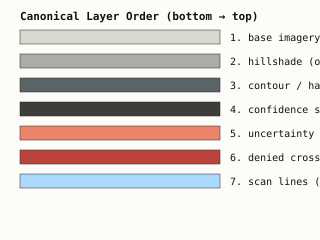

# Pattern Card — Canonical Layer Stack

> The 7-layer stack is **fixed** and **semantically ordered**. Reordering is a doctrine violation.

## Visual

## Order (bottom → top)

| # | Layer | Blend | Opacity | When suppressed |
|---|---|---|---|---|
| 1 | Base imagery / neutral substrate | `normal` | 100% | Never (foundational) |
| 2 | DEM hillshade | `overlay` | 55–65% | Never on a degraded edge device with terrain context required |
| 3 | Contour or hachure slope overlay | `multiply` | 100% | Performance suppression (after stipple) |
| 4 | Confidence stipple | `screen` | variable by provenance | First performance suppression on field tablet |
| 5 | Uncertainty wash | `normal` | variable by age tier | Last performance suppression — semantic loss is significant |
| 6 | Denied-zone crosshatch | `normal` | 100% | Never (always required when geometry present) |
| 7 | Scan-line overlay | `normal` | 4% | Whenever the surface is not a live ingest |

## Suppression order (field tablet, max 3 simultaneous textures)

1. **Semantic suppressions** (apply unconditionally before budget math)
   - Suppress scan_line_overlay when feed is not live (`non_live_cached_feed`)
2. **Performance suppressions** (apply in priority order until under budget)
   1. Drop `confidence_stipple`
   2. Drop `contour_hachure`
   3. Drop `uncertainty_wash` *(last resort — semantic loss is significant)*
3. Emit `REDUCED_SEMANTIC_FIDELITY` warning whenever any performance suppression fires.

## Why this order

The stack reads bottom-to-top in trust hierarchy: **terrain truth** at the bottom, **operational state** in the middle, **denial geometry** above all terrain interpretation, **live signal indication** on top. Inverting any pair changes what the operator sees first — and therefore changes what they trust first.

## Tokens reference

Layer compositing parameters live alongside the doctrine in [`SKILL.md`](../../sigint_terrain_bundle/SKILL.md). Per-layer fills/strokes live in [`tokens.json`](../../sigint_terrain_bundle/tokens.json).
