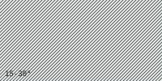

# Pattern Card — Slope Hachure

> Hachure spacing and stroke weight encode **slope severity**. Tighter spacing = steeper slope.

## Mapping

| Slope band | Spacing | Visual | Trafficability inference |
|---|---|---|---|
| 0–5° | not rendered | (clean substrate) | Flat. Drivable, walkable. |
| 5–15° | 8 px |  | Gentle. Most vehicles fine. |
| 15–30° | 4 px |  | Moderate. Tracked vehicles preferred. |
| 30–45° | 2 px |  | Steep. Foot mobility difficult. |
| 45° + | 1 px (heavier stroke) |  | Effectively impassable for ground assets. |

## Doctrine rules

- Rendered as **layer 3** (blend: `multiply`, opacity 100%).
- Hachure is enabled automatically for `slope_overlay`, `mobility_planning`, and `landing_zone_assessment` modes.
- Spacing **must** correlate with measured slope from the DEM derivative — never with stylistic preference.
- At zoom < 12, density may be simplified (drop alternating lines) but the band-to-spacing mapping must remain visually distinguishable.

## Why these rules

An operator should be able to read trafficability **without** consulting a legend. Tight hachure = steep = slow or impassable. The mapping is monotonic: density always increases with severity.

## Tokens reference

[`tokens.json`](../../sigint_terrain_bundle/tokens.json) → `palettes.slope_severity.bands`.
