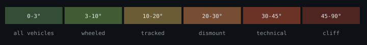

# Pattern Card — Slope Hachure

> Hachure spacing and stroke weight encode **slope severity**. Tighter spacing = steeper slope. Each band carries a doctrine **mobility classification** that operators read without consulting a legend.

## Severity bar (full doctrine)

## Mapping

| Slope band | Mobility | Spacing | Hachure | Trafficability inference |
|---|---|---|---|---|
| 0–3° | all vehicles | not rendered | (clean substrate) | Flat. Anything moves. |
| 3–10° | wheeled | 10 px |  | Gentle. Wheeled vehicles fine. |
| 10–20° | tracked | 7 px |  | Moderate. Tracked vehicles preferred. |
| 20–30° | dismount | 5 px |  | Dismount. Wheeled struggle; foot OK. |
| 30–45° | technical | 3 px |  | Steep. Technical foot mobility. |
| 45–90° | cliff | 1 px (heavier stroke) |  | Cliff. Effectively impassable for ground assets. |

## Doctrine rules

- Rendered as **layer 3** (blend: `multiply`, opacity 100%).
- Hachure is enabled automatically for `slope_overlay`, `mobility_planning`, and `landing_zone_assessment` modes.
- Spacing **must** correlate with measured slope from the DEM derivative — never with stylistic preference.
- At zoom < 12, density may be simplified (drop alternating lines) but the band-to-spacing mapping must remain visually distinguishable.
- Mobility labels (`all vehicles` … `cliff`) are part of the doctrine, not UI chrome — downstream renderers must surface them in tooltips, legends, or callouts.

## Why these rules

An operator should be able to read trafficability **without** consulting a legend. Tight hachure = steep = slow or impassable. The mapping is monotonic: density always increases with severity, and the mobility tier is the operational consequence.

## Tokens reference

[`tokens.json`](../../sigint_terrain_bundle/tokens.json) → `palettes.slope_severity.bands` (each band carries `name`, `label`, `mobility`, `spacing_px`, `stroke_width_px`, `fill`).
